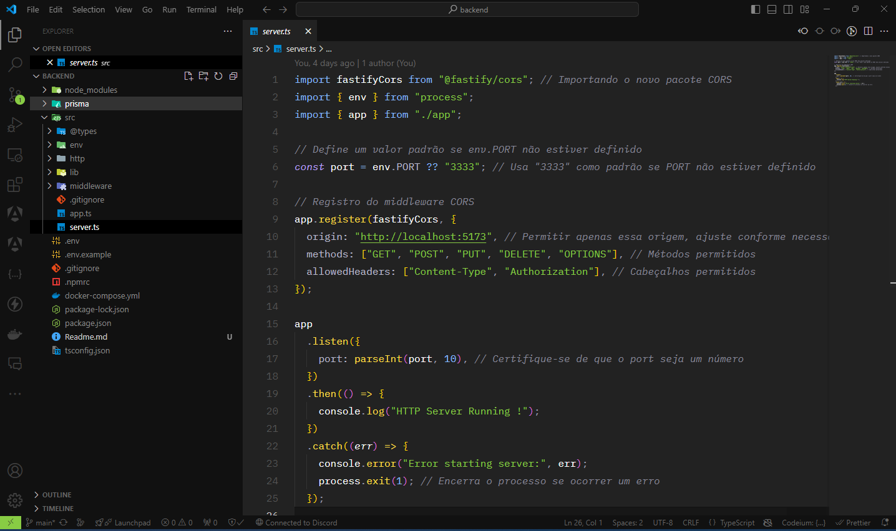

<h1 align="center">Node Typescript Fastify Prisma Docker Backend - Gerenciamento de Orçamento</h1>

<p align="center">
  
  
  

  
  
  <a href="https://github.com/JeanGomes01/budget-manager-backend/commits/master">
    
  </a>

  <a href="https://github.com/JeanGomes01/budget-manager-backend/stargazers">
    
  </a>
</p>

<p align="center">

</p>

<p align="center">Budget Manager é uma aplicação completa para gerenciamento de orçamentos, projetada para ajudar pequenas e médias empresas a organizar e acompanhar seus clientes, orçamentos e materiais de forma eficiente. A aplicação permite cadastro de clientes, criação de orçamentos, associação de materiais e gerenciamento de suas finalizações. O foco está na simplicidade da interface e na robustez do back-end.</p>

## 🔧 Tecnologias Utilizadas:

Principais tecnologias utilizadas para desenvolver esta aplicação:

- [Node.js](https://nodejs.org/)
- [TypeScript](https://www.typescriptlang.org/)
- [Fastify](https://www.fastify.io/)
- [Prisma ORM](https://www.prisma.io/)
- [PostgreSQL](https://www.postgresql.org/)
- [Docker](https://www.docker.com/)
- [Zod](https://zod.dev/)

## 🛠 Funcionalidades

- **Autenticação JWT**: Segurança no acesso com tokens.
- **CRUD Completo**: Gerenciamento de usuários, clientes, orçamentos e materiais.
- **Relacionamentos**: Orçamento associado a um cliente, com múltiplos materiais.
- **Validação de Dados**: Utilização de Zod para validar as entradas na API.
- **Containerização**: Backend e banco de dados completamente containerizados com Docker.

## ⚙️ Guia de Inicialização

Para instalar e configurar uma cópia local do projeto, siga estas etapas:

### Pré-requisitos

- **Node.js**
- **Docker e Docker Compose**

1. **Clone o repositório**:

```sh
git clone https://github.com/JeanGomes01/budget-manager-backend.git
```

2. **Instale as dependências:**

```sh
cd budget-manager-backend
npm install
```

3. **Configure as variáveis de ambiente:
   Crie um arquivo .env baseado no .env.example e preencha com as informações necessárias, como as credenciais do banco de dados.**

```

```

4. **Suba os containers do banco de dados com Docker:**

```sh
docker-compose up -d
```

5. **Gere o Prisma Client e sincronize as tabelas no banco de dados:**

```sh
npx prisma migrate dev
```

6. **Inicie o servidor:**

```sh
npm run dev
```

A API estará disponível em http://localhost:3333.

**API Endpoints**
A API provê os seguintes endpoints:

**GET /users - Recupera uma lista de todos os usuários**

```json
[
  {
    "id": 1,
    "firstName": "William",
    "lastName": "Silva",
    "document": "123456787",
    "email": "william@mail.com",
    "password": "senha123",
    "balance": 10.0,
    "userType": "MERCHANT"
  },
  {
    "id": 4,
    "firstName": "Jorge",
    "lastName": "Silva",
    "document": "12342223",
    "email": "jorge@mail.com",
    "password": "senha321",
    "balance": 50.0,
    "userType": "COMMON"
  }
]
```

**POST /users - Registrar um novo usuário na aplicação**

```json
{
  "firstName": "William",
  "lastName": "Silva",
  "password": "senha123",
  "document": "123456787",
  "email": "william@mail.com",
  "userType": "COMMON",
  "balance": 10
}
```

**GET /budgets - Lista todos os orçamentos**

```json
[
  {
    "id": 1,
    "clientId": 1,
    "finalized": false,
    "createdAt": "2024-09-26T12:00:00.000Z"
  }
]
```

**POST /budgets - Cria um novo orçamento**

```json
{
  "clientId": 1,
  "materials": [
    {
      "name": "Material A",
      "quantity": 5
    },
    {
      "name": "Material B",
      "quantity": 10
    }
  ]
}
```

📦 Docker
Este projeto utiliza Docker para containerizar o banco de dados e o servidor. Para rodar os serviços, utilize:

sh
Copiar código
docker-compose up -d
Isso irá iniciar o PostgreSQL e a aplicação Node.js.

## ✅Roadmap

- [x] Registro e autenticação de usuários.
- [x] CRUD de clientes e orçamentos.
- [x] Associação de materiais aos orçamentos.
- [x] Integração com Docker para fácil implantação.
- [x] Validação de dados com Zod.

**🤝 Contribuição:**
Se você deseja contribuir com este projeto:

Faça um fork do repositório.
Crie uma branch para sua feature (git checkout -b minha-feature).
Faça o commit das suas alterações (git commit -m 'Minha nova feature').
Faça o push para a branch (git push origin minha-feature).
Abra um Pull Request.

```

```
